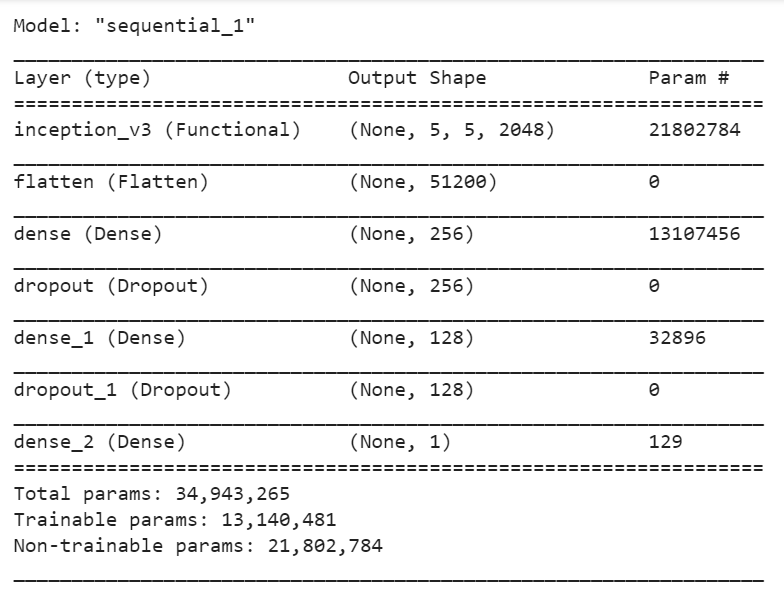

# **Hotdog Not Hotdog Classifier**

This is a web app inspired by the Jian Yang's SeaFood app from the TV show Silicon Valley. If you didn't watch this show just go to the link mentioned under to see what this is all about.

<a href = "https://youtu.be/pqTntG1RXSY">Click Here : Hotdog or not Hotdog</a>

# **Table of Contents**

-   [Technologies](#Technologies)
-   [Screen Capture](#Screen-Capture)
-   [Model Architecture](#Model-Architecture)
-   [How to run this app](#How-to-run-this-app)

# **Technologies**

-   Tensorflow 2.3
-   Keras 2.4
-   Python 3.7
-   HTML 5
-   CSS 3
-   Javascript
-   Flask

# **Screen Capture**

 

# **Model Architecture**

 

# **How to run this app**

-   step-1-- Create a project directory in your local machine
-   step-2-- cd to the project directory
-   step-3-- Run `git clone https://github.com/SaihanTaki/Hotdog-Not-Hotdog-Classifier.git` in your shell to clone the repo or simply download the zip file
-   step-4-- Create a virtual environment
-   step-5-- Activate the virtual environment
-   step-6-- Run `cd Hotdog-Not-Hotdog-Classifier` in your shell
-   step-7-- Run `pip install -r requirements.txt` in your shell
-   step-8-- Run `flask run` or `python app.py` in your shell
